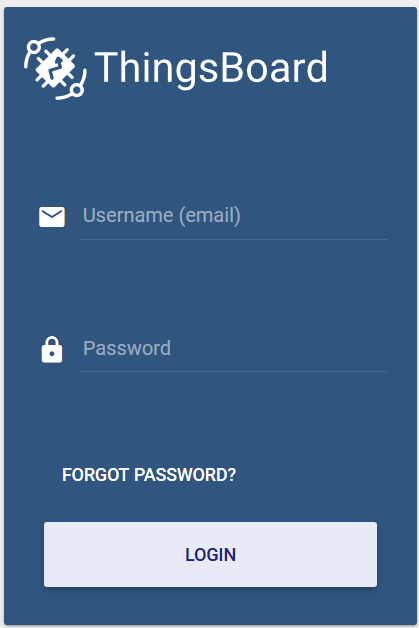

## 安装Cassandra
参考apache Cassandra的官网[页面](http://cassandra.apache.org/download/)
- 配置repository，创建文件`/etc/yum.repos.d/cassandra.repo`,内容如下
```
[cassandra]
name=Apache Cassandra
baseurl=https://www.apache.org/dist/cassandra/redhat/311x/
gpgcheck=1
repo_gpgcheck=1
gpgkey=https://www.apache.org/dist/cassandra/KEYS
```
- 执行命令`sudo yum install cassandra`安装
- 安装完成以后，启动Cassandra： `service cassandra start`
- 另外，可以配置开机启动： `chkconfig cassandra on`

### install thingsboard using docker (centos)  
reference page: https://thingsboard.io/docs/user-guide/install/docker/
- 三种安装选项
  - thingsboard/tb-postgres
  - thingsboard/tb-cassandra
  - thingsboard/tb：这种通常仅用于自动化测试
- 安装命令：
```
docker run -it -p 9090:9090 -p 1883:1883 -p 5683:5683/udp -v ~/.mytb-data:/data -v ~/.mytb-logs:/var/log/thingsboard --name mytb --restart always thingsboard/tb-postgres

docker run -it -p 17080:9090 -p 1883:1883 -p 5683:5683/udp -v /app/tb/.mytb-data:/data -v /app/tb/.mytb-logs:/var/log/thingsboard --name tbtesting thingsboard/tb

docker run -it -p 17080:9090 -p 1883:1883 -p 5683:5683/udp -v /app/tb/.mytb02-data:/data -v /app/tb/.mytb02-logs:/var/log/thingsboard --name tbcassandra thingsboard/tb-cassandra

docker run -it -p 9090:9090 -p 1883:1883 -p 5683:5683/udp -v /application/data/tb/.dztb01-cassandra-data:/data -v /application/data/tb/dztb01-log:/var/log/thingsboard --name dztbcassandra01 thingsboard/tb-cassandra
```
- 启动完成以后，就可以通过宿主机的ip和设定好的端口映射访问thingsboard的控制台了  

  - 用户名：sysadmin@thingsboard.org
  - 密码：sysadmin
  - 其他的demo account请参考[此页面](https://thingsboard.io/docs/samples/demo-account/)
  - tenant@thingsboard.org  3L4q!j6GW

- 关于thingsboard的配置，这里有全面的[配置项列表](https://thingsboard.io/docs/user-guide/install/config/)


```

docker exec -it e5fbbff3ca3a /bin/bash
docker inspect e5fbbff3ca3a
cqlsh -u cassandra -p cassandra


start-tb.sh

"CASSANDRA_HOST=localhost",
"CASSANDRA_PORT=9042"
"DATABASE_TS_TYPE=cassandra",
"DATABASE_ENTITIES_TYPE=cassandra",
```