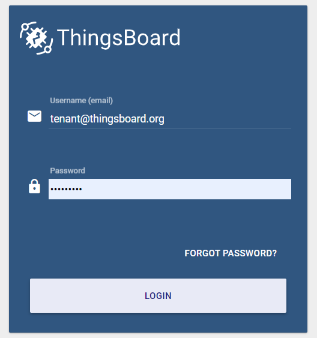
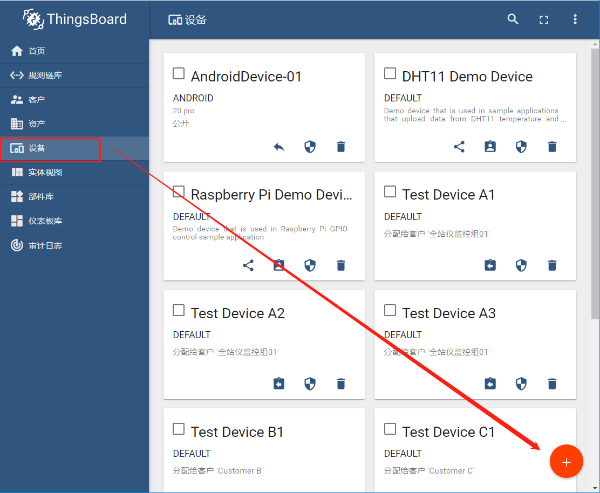
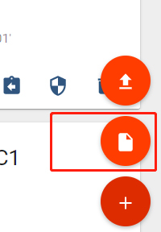
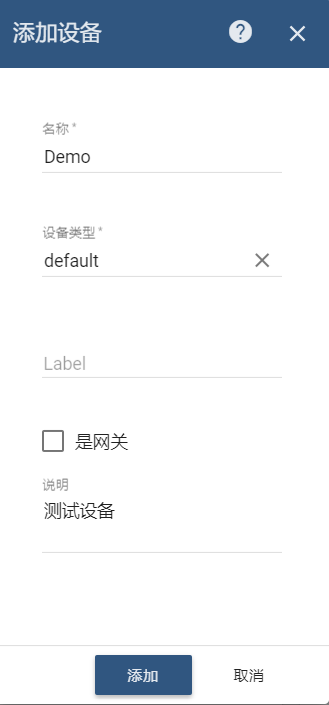
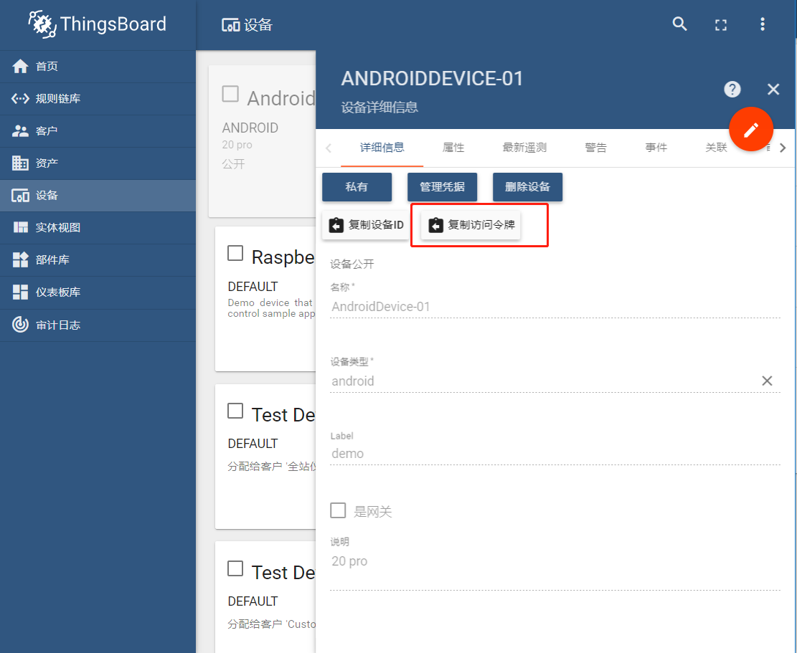
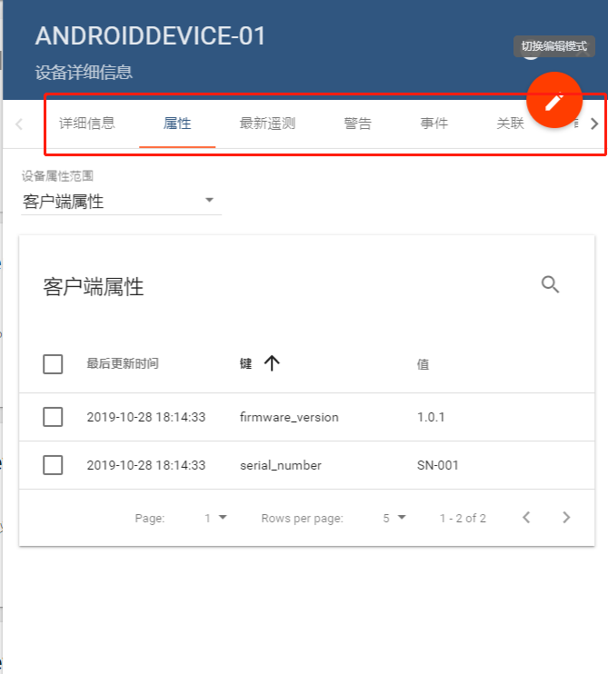
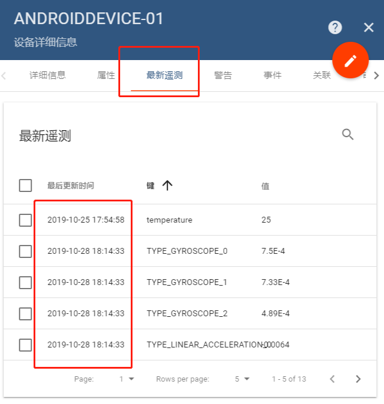

- 登录[TB后台](http://47.105.116.136:9090/login)  
  - 用户名： tenant@thingsboard.org
  - 密码： 3L4q!j6GW  


- 创建一个设备（当然，也可以复用已有的设备）  
   
点击新建设备按钮：  
  
填写设备信息表单，参考如下：  
  

- 创建好设备以后，在设备列表中点选刚刚创建的设备，在出现的设备信息面板中，点击“复制访问令牌”按钮，将已创建的设备的访问令牌复制下来。


  - 另外，在设备信息面板中，还可以查看设备的“属性”(设备相对固定的信息，例如序列号)，最新的一次数据以及关联的警告，事件等等  


- 有了上一步获得的设备的“访问令牌”，即可使用MQTT进行推送了，下面提供使用http和mqtt两种协议进行数据推送的示例：
  - 使用nodejs和mqtt库进行推送的参考（其他语言，如java，c#逻辑类似）

```
var mqtt = require('mqtt');

// 注意，这里的IP地址，即hostname，是47.105.116.136，端口使用默认的mqtt端口1883
// 第二个参数就是前文提到的访问令牌
console.log('Connecting to: %s using access token: %s', '47.105.116.136', 'dt23iJdTHkNXyJdUn09p');

// “遥测数据”样例，json格式，字段的名字就是测量项的名字，值就是当前测量项的值
var telemetry = '{"TYPE_ORIENTATION_0": 328.989990,"TYPE_ORIENTATION_1": -5.660000,"TYPE_ORIENTATION_2": -0.700000,"TYPE_GYROSCOPE_0": 0.000750,"TYPE_GYROSCOPE_1": 0.000733,"TYPE_GYROSCOPE_2": 0.000489,"TYPE_PROXIMITY_0": 5.000000,"TYPE_PROXIMITY_1": 233.000000,"TYPE_PROXIMITY_2": 0.000000,"TYPE_LINEAR_ACCELERATION_0": -0.006400,"TYPE_LINEAR_ACCELERATION_1": -0.006800,"TYPE_LINEAR_ACCELERATION_2": -0.029800}';

var attrib = '{"firmware_version":"1.0.1", "serial_number":"SN-001"}';

// 使用url和令牌进行连接
var client  = mqtt.connect('mqtt://'+ '47.105.116.136',{
    username: 'dt23iJdTHkNXyJdUn09p'
});

client.on('connect', function () {
    console.log('Client connected!');

    //这一句是用来推送“属性数据”的，通常，我们不会经常更改属性数据
    client.publish('v1/devices/me/attributes', attrib);
    console.log('Attributes published!');

    //这一句是用来推送“遥测数据”的，通常，我们会以一个时间间隔不断推送数据到平台上
    client.publish('v1/devices/me/telemetry', telemetry);
    console.log('Telemetry published!');

    client.end();
});
```
  - 使用`curl`命令，以http协议推送数据：  
```
curl -v -X POST -d "{\"TYPE_ORIENTATION_0\": 328.989990,\"TYPE_ORIENTATION_1\": -5.660000,\"TYPE_ORIENTATION_2\": -0.700000,\"TYPE_GYROSCOPE_0\": 0.000750,\"TYPE_GYROSCOPE_1\": 0.000733,\"TYPE_GYROSCOPE_2\": 0.000489,\"TYPE_PROXIMITY_0\": 5.000000,\"TYPE_PROXIMITY_1\": 233.000000,\"TYPE_PROXIMITY_2\": 0.000000,\"TYPE_LINEAR_ACCELERATION_0\": -0.006400,\"TYPE_LINEAR_ACCELERATION_1\": -0.006800,\"TYPE_LINEAR_ACCELERATION_2\": -0.029800}" http://47.105.116.136:9090/api/v1/dt23iJdTHkNXyJdUn09p/telemetry --header "Content-Type:application/json"
```  
注意，这里请求体里面就是json格式封装的测量数据，url里面包含了设备的访问令牌

- 若数据推送成功，可以在thingsboard的控制台的对应设备的设备面板的“最新遥测”选项卡中看到你最新推送的数据  
  
如果要处理这些数据，可以使用规则引擎，也可以在数据库中看到。或者使用仪表板来对测量数据进行可视化和实时刷新。