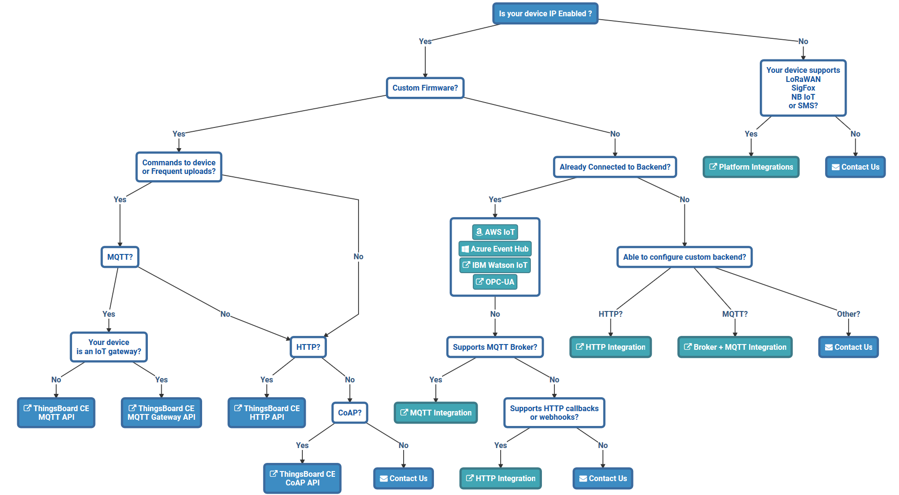

## 接入
关于物联网终端设备的接入方式，下面这张图可以清晰的表达：

这张图来源于[这里](https://thingsboard.io/docs/getting-started-guides/connectivity/)

### ThingsBoard supports 3 kinds of protocals
- HTTP
- MQTT
- CoAP

## Attribute types
- server-side: attributes are reported and managed by the server-side application. Not visible to the device application. Some secret data that may be used by thingsboard rules but should not be available to the device. Any ThingsBoard entity supports server-side attributes: Device, Asset, Customer, Tenant, Rules, etc.

- client-side: attributes are reported and managed by the device application. For example current software/firmware version, hardware specification, etc.

- shared: attributes are reported and managed by the server-side application. Visible to the device application. For example customer subscription plan, target software/firmware version.

## 数据处理  
  
A device that is sending data to the server will receive confirmation about data delivery as soon as data is stored in DB. Modern MQTT clients allow temporary local storage of undelivered data. Thus, even if one of the ThingsBoard nodes goes down, the device will not lose the data and will be able to push it to other servers.

